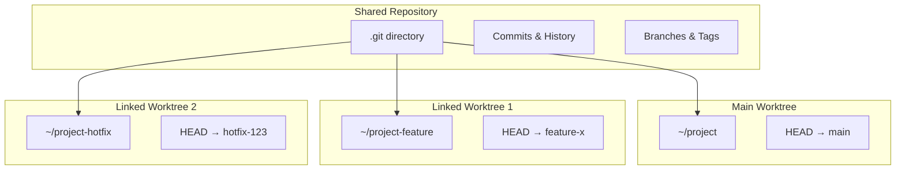
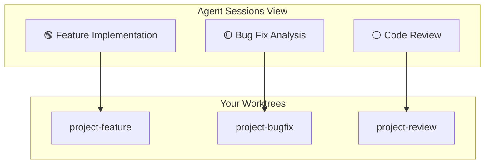
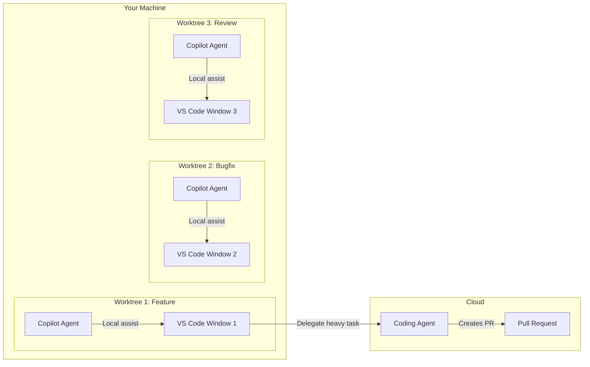

# Git Worktree + Copilot Agents

## Parallel Development Superpowers

<div class="pt-12">
  <span class="px-2 py-1 rounded cursor-pointer" hover="bg-white bg-opacity-10">
    Press Space to continue <carbon:arrow-right class="inline"/>
  </span>
</div>

<div class="abs-br m-6 flex gap-2">
  <a href="https://git-scm.com/docs/git-worktree" target="_blank" class="text-xl slidev-icon-btn opacity-50 !border-none !hover:text-white">
    <carbon:logo-github />
  </a>
</div>

<!--
Welcome everyone! Today we'll explore how git worktree combined with GitHub Copilot Agents can supercharge your development workflow. We'll see how to work on multiple branches simultaneously without context switching pain.
-->

---
transition: fade-out
layout: center
class: text-center
---

# The Problem 😩

<v-clicks>

## Sound familiar?

</v-clicks>

<!--
Let's start by talking about a problem we all face daily...
-->

---
layout: default
---

# The Context Switching Nightmare

<v-clicks>

- 🔄 **Mid-feature, urgent bug report comes in**
  - Stash changes, switch branch, fix bug, switch back, pop stash... hope nothing breaks

- 🧠 **Mental context loss**
  - "Wait, what was I working on again?"

- 📦 **Multiple PRs in flight**
  - Waiting for review on PR #1, want to start feature #2 that depends on it

- ⏱️ **Time wasted**
  - Average developer loses 23 minutes to regain focus after interruption

- 🤯 **Stash conflicts**
  - `git stash pop` → CONFLICT → 💥

</v-clicks>

<!--
We've all been there. You're deep in a complex refactoring, your boss walks in with an urgent production bug. Now you have to stash everything, switch branches, fix the issue, and somehow get back to where you were. Each context switch costs you mental energy and time. Studies show it takes about 23 minutes to fully regain focus after an interruption.
-->

---
layout: center
class: text-center
---

# What if you could...

<v-clicks>

## Work on multiple branches **simultaneously**?

## Without stashing?

## Without losing context?

</v-clicks>

<!--
What if I told you there's a better way? What if you could have multiple branches checked out at the same time, each in their own directory, fully independent?
-->

---
layout: cover
background: https://images.unsplash.com/photo-1618401471353-b98afee0b2eb?w=1920
---

# Enter: Git Worktree 🌳

<!--
Enter git worktree - a powerful but underused feature that's been in Git since version 2.5
-->

---
layout: two-cols
layoutClass: gap-16
---

# What is Git Worktree?

A single repository can support **multiple working trees**.

Each worktree has:
- Its own directory
- Its own `HEAD`
- Its own `index` (staging area)
- Its own checked out files

<v-click>

But they **share**:
- The same `.git` repository data
- All commits, branches, and refs
- Git history

</v-click>

::right::



<!--
Git worktree allows a single repository to have multiple working directories. Each worktree has its own HEAD, index, and working files - but they all share the same repository data. This means commits made in one worktree are immediately available in all others.
-->

---
layout: default
---

# Core Worktree Commands

<v-clicks>

### Create a new worktree

```bash
# Create worktree with existing branch
git worktree add ../project-feature feature-branch

# Create worktree with NEW branch
git worktree add -b hotfix-123 ../project-hotfix main
```

### List all worktrees

```bash
git worktree list
# Output:
# /home/dev/project         abc1234 [main]
# /home/dev/project-feature def5678 [feature-branch]
# /home/dev/project-hotfix  ghi9012 [hotfix-123]
```

### Remove a worktree

```bash
git worktree remove ../project-hotfix
```

</v-clicks>

<!--
Here are the essential commands. Creating a worktree is simple - just specify a path and a branch. You can create a new branch at the same time with -b flag. Listing shows all your worktrees with their current commits and branches. And removing is just as easy when you're done.
-->

---
layout: default
---

# More Worktree Commands

```bash {all|1-2|4-5|7-8|10-11|13-14}
# Move a worktree to a new location
git worktree move ../project-feature ../new-location

# Lock a worktree (prevents pruning, useful for network drives)
git worktree lock ../project-feature --reason "Working remotely"

# Unlock a worktree
git worktree unlock ../project-feature

# Clean up stale worktree references
git worktree prune

# Repair broken worktree links after manual moves
git worktree repair
```

<v-click>

<div class="mt-8 p-4 bg-blue-500 bg-opacity-20 rounded-lg">
  <strong>💡 Pro Tip:</strong> Use <code>--lock</code> when creating worktrees on network drives or removable media to prevent accidental cleanup.
</div>

</v-click>

<!--
There are additional commands for managing worktrees. Move lets you relocate a worktree. Lock prevents it from being cleaned up - useful if you're working on a network drive or the worktree is on a USB drive. Prune cleans up references to worktrees that no longer exist. And repair fixes broken links if you manually moved directories.
-->

---
layout: center
---

# Real-World Scenario: The Boss Interruption 👔

<!--
Let's walk through the classic scenario from the git documentation...
-->

---
layout: default
---

# The Boss Scenario - Traditional Way 😰

```bash {all|1-2|4-8|10-14|16-18}
# You're deep in a refactoring session...
git status  # Modified: 47 files

# Boss: "DROP EVERYTHING! Production is down!"
git stash push -m "WIP: major refactoring"
git checkout main
git pull
git checkout -b emergency-fix

# Fix the issue...
vim critical-file.js
git add .
git commit -m "fix: emergency production fix"
git push origin emergency-fix

# Try to get back to work...
git checkout feature-refactor
git stash pop  # 🤞 Please don't conflict...
```

<v-click>

<div class="text-center text-2xl mt-4">
  😫 Context lost. Flow broken. Stash conflicts possible.
</div>

</v-click>

<!--
Here's the traditional approach. You're 47 files deep into a refactoring. Boss comes in with an emergency. You have to stash everything, switch to main, create a fix branch, make the fix, push it, then try to get back. And when you stash pop, you're praying there are no conflicts. Your mental context? Gone.
-->

---
layout: default
---

# The Boss Scenario - Worktree Way 😎

```bash {all|1-2|4-6|8-12|14-16}
# You're deep in a refactoring session...
git status  # Modified: 47 files - KEEP WORKING HERE

# Boss: "DROP EVERYTHING! Production is down!"
git worktree add -b emergency-fix ../project-hotfix main
cd ../project-hotfix

# Fix the issue in the NEW worktree...
vim critical-file.js
git add .
git commit -m "fix: emergency production fix"
git push origin emergency-fix

# Done! Go back to your original work
cd ../project
# Everything is EXACTLY as you left it! 🎉
git worktree remove ../project-hotfix
```

<v-click>

<div class="text-center text-2xl mt-4">
  ✨ Zero context loss. No stashing. Clean separation.
</div>

</v-click>

<!--
Now the worktree way. Same scenario, but you simply create a new worktree for the hotfix. Your original work stays exactly where it is - all 47 modified files untouched. You make the fix in the new worktree, push it, and when you're done, you just go back to your original directory. Everything is exactly as you left it. Remove the worktree when done.
-->

---
layout: two-cols
layoutClass: gap-8
---

# More Use Cases

### 🔍 Code Review While Coding

```bash
# Keep working on feature-A
# Reviewer needs changes on feature-B

git worktree add ../review feature-B
cd ../review
# Make review changes
git commit -am "address review feedback"
git push
cd ../project
# Never stopped working on feature-A!
```

::right::

### 🧪 Testing on Multiple Branches

```bash
# Run tests on main while coding
git worktree add ../test-main main
cd ../test-main
npm test  # Let this run...

# In another terminal, keep coding
cd ../project
# Continue development!
```

<v-click>

### 🔀 Comparing Implementations

```bash
# Compare two approaches side-by-side
git worktree add ../approach-a feature/approach-a
git worktree add ../approach-b feature/approach-b
# Open both in VS Code split view!
```

</v-click>

<!--
Here are more practical use cases. Code review - you can address review comments on one branch while continuing to work on another. Testing - run your test suite on main in one worktree while continuing to develop in another. And you can even compare two different implementation approaches side by side by having both checked out simultaneously.
-->

---
layout: cover
background: https://images.unsplash.com/photo-1677442136019-21780ecad995?w=1920
---

# Enter: GitHub Copilot Agents 🤖

## The Unified Agent Experience

<!--
Now let's talk about how GitHub Copilot Agents can supercharge this workflow even further.
-->

---
layout: default
---

# The Year of the Agent 🚀

2025 has been **"the year of the Agent"** in VS Code.

<v-clicks>

### What's New?

- **Unified Agent Experience** - Single place to manage all coding agents
- **Agent Sessions View** - See all agent sessions for your project
- **Multiple Agents** - Local and remote agents working together
- **Course Correction** - Update agents mid-run
- **Delegation** - Send any task to any agent

</v-clicks>

<v-click>

<div class="mt-8 p-4 bg-purple-500 bg-opacity-20 rounded-lg">
  <strong>🎯 Key Insight:</strong> Just like worktrees give you parallel branches, agents give you parallel AI assistants - each with their own context and focus.
</div>

</v-click>

<!--
2025 has been the year of AI agents in VS Code. The unified agent experience gives you a single place to manage multiple coding agents. You can see all agent sessions, run multiple agents simultaneously, and even course-correct them while they're working. The parallel here to worktrees is powerful - just as worktrees give you parallel branches, agents give you parallel AI assistants.
-->

---
layout: default
---

# Meet the Agents 🤖

<div class="grid grid-cols-2 gap-8 mt-8">

<v-clicks>

<div class="p-4 bg-blue-500 bg-opacity-20 rounded-lg">
  <h3>GitHub Copilot</h3>
  <p class="text-sm">The core AI assistant</p>
  <ul class="text-sm mt-2">
    <li>Inline code suggestions</li>
    <li>Chat-based assistance</li>
    <li>Code explanations</li>
    <li>Always available</li>
  </ul>
</div>

<div class="p-4 bg-green-500 bg-opacity-20 rounded-lg">
  <h3>Copilot Coding Agent (Cloud)</h3>
  <p class="text-sm">Autonomous cloud-based coding</p>
  <ul class="text-sm mt-2">
    <li>Works asynchronously</li>
    <li>Creates branches & PRs</li>
    <li>Implements entire features</li>
    <li>Runs while you sleep 😴</li>
  </ul>
</div>

<div class="p-4 bg-orange-500 bg-opacity-20 rounded-lg">
  <h3>GitHub Copilot CLI</h3>
  <p class="text-sm">Terminal command assistance</p>
  <ul class="text-sm mt-2">
    <li>Explains commands</li>
    <li>Suggests shell commands</li>
    <li>Git operations help</li>
    <li>Works in any terminal</li>
  </ul>
</div>

<div class="p-4 bg-pink-500 bg-opacity-20 rounded-lg">
  <h3>Copilot Edits</h3>
  <p class="text-sm">Multi-file editing mode</p>
  <ul class="text-sm mt-2">
    <li>Edit multiple files at once</li>
    <li>Refactoring across codebase</li>
    <li>Review changes before applying</li>
    <li>Iterate on edits conversationally</li>
  </ul>
</div>

</v-clicks>

</div>

<!--
Let's meet all the agents. GitHub Copilot is your core assistant - always there for inline suggestions and chat. The Copilot Coding Agent runs in the cloud, working autonomously to implement features and create PRs even when you're not at your computer. GitHub Copilot CLI helps with terminal commands. And OpenAI Codex, now integrated via Copilot Pro+, brings advanced reasoning and complex code generation capabilities.
-->

---
layout: default
---

# Agent Sessions View 📋

<div class="grid grid-cols-2 gap-8">

<div>

### What You Get

<v-clicks>

- **Session Overview** - All active agent sessions
- **Status Tracking** - Running, idle, completed
- **Quick Navigation** - Jump between sessions
- **Chat Editors** - Tabbed experience for each agent
- **Progress Watching** - See work as it happens

</v-clicks>

</div>

<div>



</div>

</div>

<v-click>

<div class="mt-4 p-4 bg-yellow-500 bg-opacity-20 rounded-lg">
  <strong>💡 The Pattern:</strong> One worktree per task + One agent session per worktree = Maximum parallel productivity
</div>

</v-click>

<!--
The Agent Sessions view in VS Code gives you an overview of all your active agent sessions. You can see their status, jump between them, and watch progress in real-time through tabbed chat editors. Notice the pattern emerging here - you can have one agent per worktree, each working on their own task in isolation.
-->

---
layout: default
---

# The Planning Agent 📝

A built-in agent for turning vague ideas into detailed plans.

```text
You: "I need to add authentication to this app"

Planning Agent:
├── Analyzes your codebase
├── Asks clarifying questions
│   ├── "OAuth or username/password?"
│   ├── "Which providers do you need?"
│   └── "Do you need 2FA support?"
├── Recommends libraries (passport.js, next-auth, etc.)
├── Creates detailed implementation plan
└── Offers to hand off to implementation agent
```

<v-clicks>

### Handoff Feature

- Review the plan
- Edit if needed
- **Proceed** → Agent implements it
- **Open in Editor** → Manual implementation with plan as guide

</v-clicks>

<!--
The Planning Agent is brilliant for turning vague requirements into concrete plans. Say "I need to add authentication" and it will analyze your codebase, ask clarifying questions, recommend libraries, and create a detailed implementation plan. Then you can either let an agent implement it or use the plan as a guide for manual implementation.
-->

---
layout: default
---

# Subagents: Context Isolation 🔒

The `#runSubagent` tool prevents "Context Confusion"

<div class="grid grid-cols-2 gap-8 mt-4">

<div>

### The Problem

```text
Main Chat:
├── Working on Feature A
├── Ask about Feature B
├── Context gets mixed
├── Agent gets confused
└── Responses become incoherent
```

</div>

<div>

### The Solution

```text
Main Chat:
├── Working on Feature A
├── #runSubagent for Feature B
│   └── Isolated context
│   └── Returns only result
├── Main context stays clean
└── Clear, focused responses
```

</div>

</div>

<v-click>

### Example Usage

```text
Analyze the authentication module with #runSubagent and
recommend the best strategy for adding OAuth support
```

The subagent:
- Runs independently
- Has its own isolated context
- Returns only the final result
- Doesn't pollute your main conversation

</v-click>

<!--
Subagents solve a critical problem - context confusion. When you're working on one thing but need to ask about something else, the context can get mixed up. Subagents run in isolation with their own context and return only the final result, keeping your main conversation clean and focused.
-->

---
layout: cover
background: https://images.unsplash.com/photo-1451187580459-43490279c0fa?w=1920
---

# The Perfect Combination 🚀

## Worktrees + Agents = Parallel Development Superpowers

<!--
Now let's bring it all together - the combination of worktrees and agents.
-->

---
layout: default
---

# The Workflow: Worktree + Agent Per Task



<!--
Here's the ultimate workflow. Each worktree gets its own VS Code window with its own Copilot agent for local assistance. When you have a heavy task, you can delegate it to the cloud coding agent which works asynchronously and creates PRs for you. It's like having a team of AI developers working in parallel.
-->

---
layout: default
---

# Complete Scripted Example

```bash {all|1-3|5-8|10-13|15-19|21-24}
# Step 1: Create worktrees for parallel work
git worktree add -b feature/user-auth ../project-auth main
git worktree add -b feature/dashboard ../project-dashboard main

# Step 2: Open each in VS Code
code ../project-auth
code ../project-dashboard
code .  # Keep main open too

# Step 3: In project-auth, use Copilot
# Chat: "Help me implement JWT authentication for this Express app"
# Copilot works with you interactively
# Full context of auth worktree only

# Step 4: In project-dashboard, delegate to cloud agent
# Chat: "@coding-agent Implement a dashboard with charts showing
#        user activity. Create all necessary components and tests."
# Agent works autonomously in the cloud
# Creates PR when done

# Step 5: Continue working on main
# All three efforts happening in parallel!
# Check Agent Sessions view for cloud agent progress
git worktree list  # See all your parallel workstreams
```

<!--
Here's a complete scripted example. First, create worktrees for each task. Open each in its own VS Code window. In one window, work interactively with Copilot on authentication. In another, delegate dashboard creation to the cloud coding agent. Meanwhile, you can continue working on main. All three efforts happening in parallel, each with clean separation.
-->

---
layout: default
---

# Using Copilot CLI with Worktrees

```bash {all|1-3|5-8|10-13}
# Get help with worktree commands
gh copilot suggest "create a git worktree for a new feature branch based on main"
# Copilot CLI: git worktree add -b feature/new-feature ../project-new-feature main

# Explain a complex worktree command
gh copilot explain "git worktree add --track -b feature origin/feature"
# Copilot CLI explains: Creates a new worktree with a branch that tracks
# the remote 'origin/feature' branch...

# Troubleshoot worktree issues
gh copilot suggest "fix git worktree that says branch is already checked out"
# Copilot CLI: The branch might be checked out in another worktree.
# Try: git worktree list
# Then: git worktree remove <path> or use -f flag
```

<v-click>

<div class="mt-4 p-4 bg-cyan-500 bg-opacity-20 rounded-lg">
  <strong>🔧 Pro Tip:</strong> Use <code>gh copilot suggest</code> when you know what you want to do but forget the exact syntax. Use <code>gh copilot explain</code> when you see a command and want to understand it.
</div>

</v-click>

<!--
Copilot CLI is perfect for git worktree commands since the syntax can be tricky to remember. Use suggest to get the right command, explain to understand commands you encounter, and troubleshoot when things go wrong.
-->

---
layout: two-cols
layoutClass: gap-8
---

# Best Practices

### Worktree Organization

```bash
# Recommended directory structure
~/projects/
├── my-app/              # Main worktree
├── my-app-feature-x/    # Feature branch
├── my-app-hotfix-123/   # Hotfix branch
└── my-app-review-pr-45/ # PR review
```

<v-clicks>

- **Consistent naming**: `{project}-{purpose}`
- **Same parent directory**: Easy navigation
- **Descriptive suffixes**: Know purpose at a glance
- **Clean up regularly**: Remove finished worktrees

</v-clicks>

::right::

### Agent Best Practices

<v-clicks>

- **One focus per agent session**
  - Don't mix concerns in one chat

- **Use subagents for research**
  - Keep main context clean

- **Delegate appropriate tasks**
  - Cloud agent: Large features, refactors
  - Local Copilot: Quick fixes, explanations

- **Review agent PRs carefully**
  - AI is powerful but not perfect

- **Combine with worktrees**
  - Agent per worktree = maximum isolation

</v-clicks>

<!--
Some best practices to keep in mind. For worktrees, use consistent naming with the project name and purpose. Keep them in the same parent directory. Clean up when done. For agents, keep each session focused on one task. Use subagents for research to keep main context clean. Know which agent to use for which task. And always review AI-generated code carefully.
-->

---
layout: center
class: text-center
---

# The Power Combo Recap ⚡

<div class="grid grid-cols-2 gap-12 mt-8 text-left">

<div>

### Git Worktree Gives You

<v-clicks>

- ✅ Multiple branches checked out
- ✅ Zero stashing needed
- ✅ Complete context preservation
- ✅ Parallel development
- ✅ Clean isolation

</v-clicks>

</div>

<div>

### Copilot Agents Give You

<v-clicks>

- ✅ AI assistance per worktree
- ✅ Autonomous cloud coding
- ✅ Context-aware suggestions
- ✅ Parallel AI workers
- ✅ Planning & delegation

</v-clicks>

</div>

</div>

<v-click>

<div class="mt-8 text-2xl">
  <strong>Together:</strong> Work on multiple features simultaneously, each with dedicated AI assistance,
  <br>while cloud agents implement features autonomously.
</div>

</v-click>

<!--
Let's recap. Git worktree gives you parallel branches without stashing. Copilot agents give you AI assistance that can work autonomously. Together, you get a development superpower - multiple features in progress, each with dedicated AI help, while cloud agents work on tasks in the background.
-->

---
layout: center
class: text-center
---

# Quick Reference Card 📋

<div class="grid grid-cols-2 gap-8 text-left text-sm">

<div>

### Essential Worktree Commands

| Command | Purpose |
|---------|---------|
| `git worktree add <path> <branch>` | Create worktree |
| `git worktree add -b <new> <path>` | Create with new branch |
| `git worktree list` | List all worktrees |
| `git worktree remove <path>` | Remove worktree |
| `git worktree prune` | Clean up stale refs |

</div>

<div>

### Agent Quick Reference

| Agent | Best For |
|-------|----------|
| **Copilot** | Interactive coding, quick fixes |
| **Coding Agent** | Autonomous feature implementation |
| **Copilot CLI** | Terminal commands, git help |
| **Planning Agent** | Breaking down complex tasks |
| **Copilot Edits** | Multi-file refactoring |

</div>

</div>

<!--
Here's a quick reference to keep handy. The essential worktree commands on the left, and when to use each agent on the right.
-->

---
layout: center
class: text-center
---

# Resources 📚

<div class="grid grid-cols-2 gap-8 mt-8">

<div class="text-left">

### Git Worktree

- [Official Documentation](https://git-scm.com/docs/git-worktree)
- [Git Book - Worktrees](https://git-scm.com/book)
- `git worktree --help`

</div>

<div class="text-left">

### GitHub Copilot Agents

- [Unified Agent Experience Blog](https://code.visualstudio.com/blogs/2025/11/03/unified-agent-experience)
- [GitHub Copilot Docs](https://docs.github.com/copilot)
- [VS Code Copilot Extension](https://marketplace.visualstudio.com/items?itemName=GitHub.copilot)

</div>

</div>

<div class="mt-12">

### Try It Now!

```bash
# Create your first worktree
git worktree add -b experiment ../my-project-experiment main
code ../my-project-experiment
# Start chatting with Copilot! 🚀
```

</div>

<!--
Here are resources to learn more. The git worktree documentation is excellent, and the VS Code blog post on the unified agent experience goes into much more detail about all the agent capabilities.
-->

---
layout: cover
background: https://images.unsplash.com/photo-1522071820081-009f0129c71c?w=1920
class: text-center
---

# Questions? 🙋

<div class="mt-8">

## Thank You!

<div class="mt-4 text-lg opacity-80">
  Start using git worktree + Copilot agents today
  <br>
  and unlock your parallel development superpowers!
</div>

</div>

<!--
Thank you for attending! I'm happy to answer any questions about git worktree, Copilot agents, or how to combine them in your workflow.
-->
